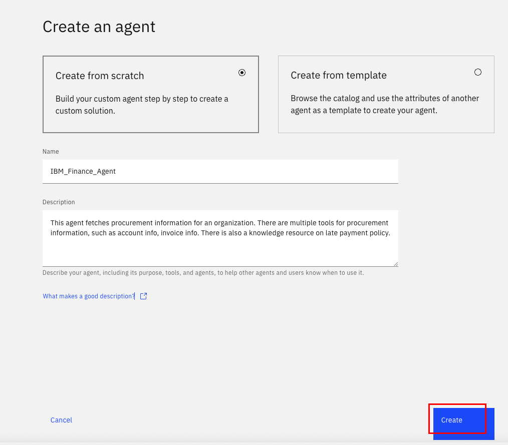
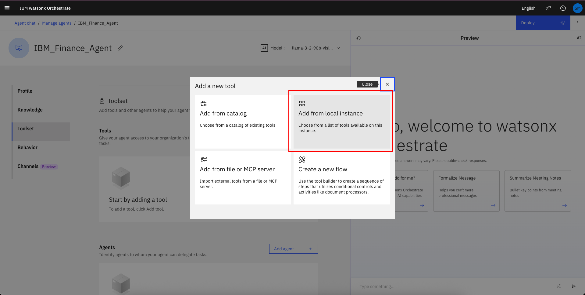
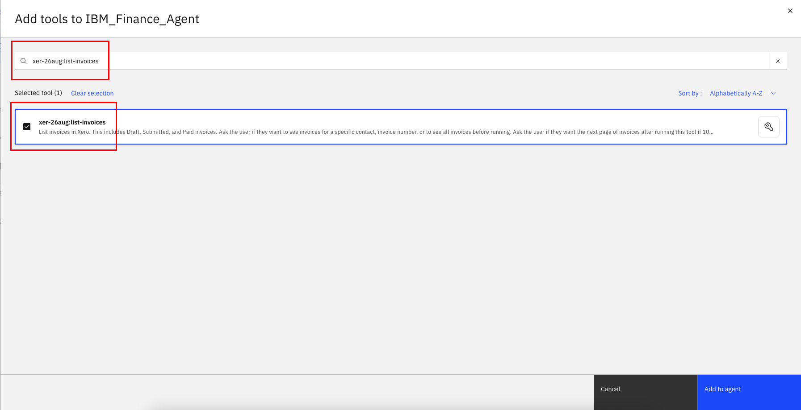
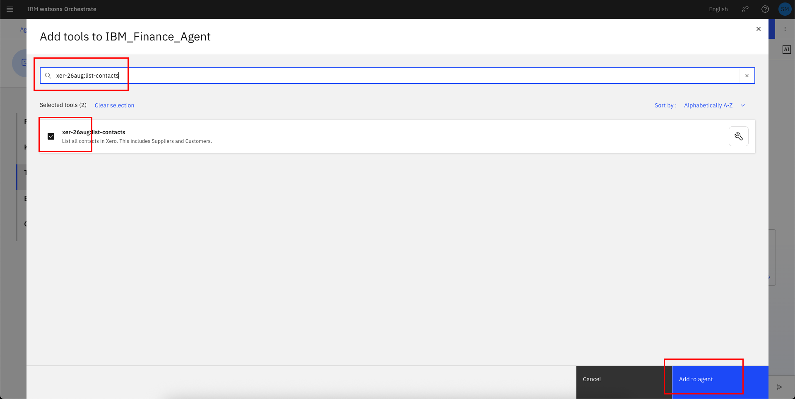
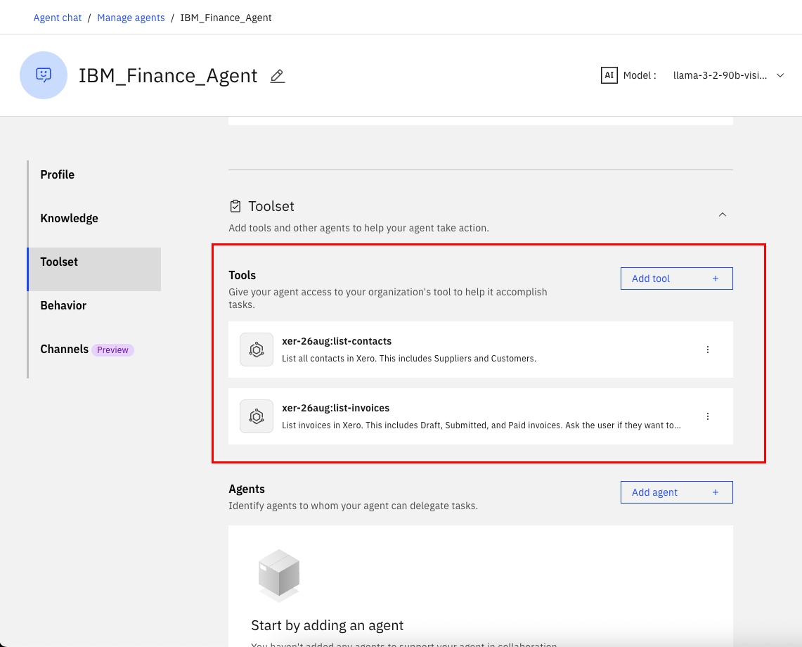
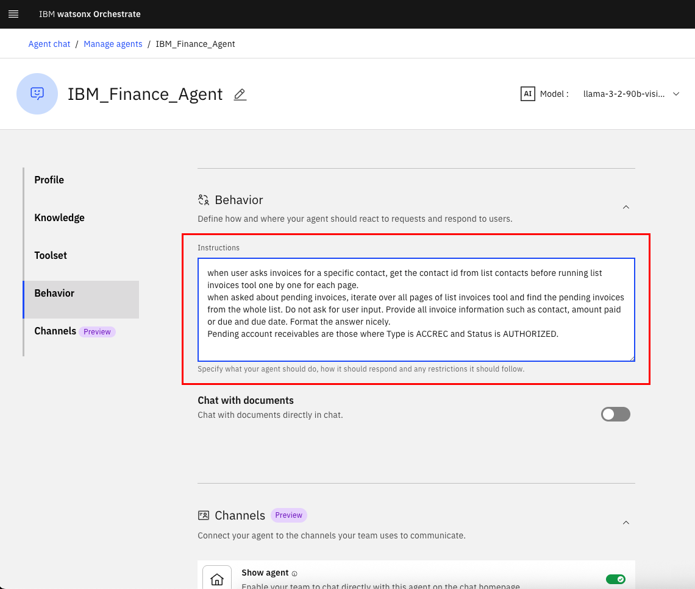
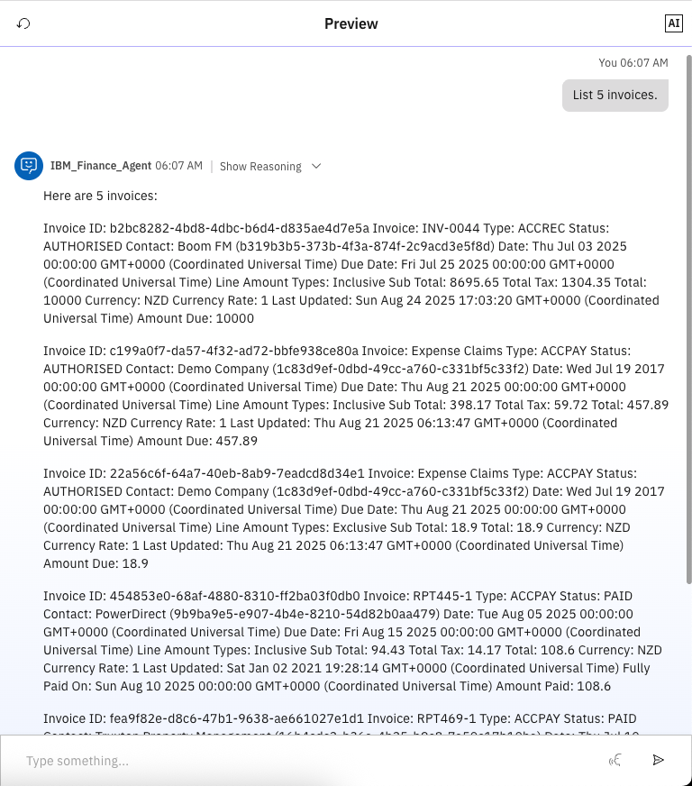
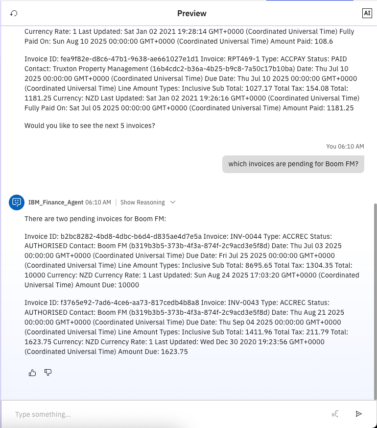

# 🏦 Finance Agent: Automate finance oriented tasks with Agentic AI. 
# (Lab 1: Building a simple multi tool agent)

## Use Case Description

This use case targets developing and deploying an Finance agent leveraging IBM watsonx Orchestrate. This agent will empower employees to interact with finance systems and access information efficiently through conversational AI.

In lab 1, we will build a Finance agent in watsonx Orchestrate, provide it with tools to list invoices and contacts. 

## Step by step instructions:

1. When you launch watsonx Orchestrate, you'll be directed to this page. Click on the hamburger menu in the top left corner:
   
2. Click on the down arrow next to **Build**. Then click on **Agent Builder**:
   
3. Click on **Create agent**:
   
4. Select "Create from scratch", give your agent a unique name (make sure to identify yourself by your initials or name, since this is a shared instance), e.g. "[Your Initial]\_Finance_Agent", and fill in the description as shown below:
   ```
   This agent fetches procurement information for an organization. There are multiple tools for procurement information, such as account info, invoice info. There is also a knowledge resource on late payment policy.
   ```


5. Select Agent Style as **ReAct**


6. Scroll to the **Toolset** section. Click on **Add tool**:


7. Click on the **Add from local instance**:


8. Search for "list-invoices" and select the tool by checking the box:


9. Search for "list-contacts" and select the tool by checking the box. Then click on **Add to agent**:


10. Wait until the tools has been added successfully and double check that it is now shown in the **Toolset** section:


11. Scroll down to the **Behavior** section. Insert the instructions below into the **Instructions** field:

   ```
   When the user asks for invoices for a contact, first get the contact_id from List Contacts. Then call List Invoices with that contact_id and iterate through all pages until no more invoices are returned (using next_page_token, has_more, total_pages, or page size logic). Collect all invoices.

   When the user asks for pending invoices, retrieve all invoices across all pages (with or without contact filter) and return only those with Type = ACCREC and Status = AUTHORIZED.

   Do not ask the user for input. Always include contact name, invoice type, amount paid, amount due, due date, and status. Format the results in a clear table or list.

   Pending account receivables = Type ACCREC and Status AUTHORIZED.

   ```


11. Test your agent in the preview chat on the right side by asking the following questions and validating the responses. They should look similar to what is shown in the screenshot(s) below:

```
List 5 invoices.
```



```
which invoices are pending for Boom FM?
```


