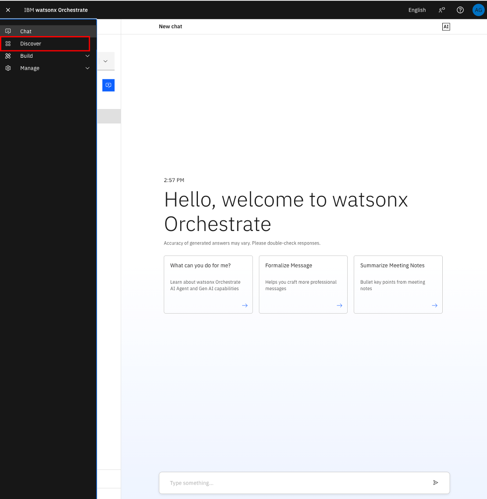
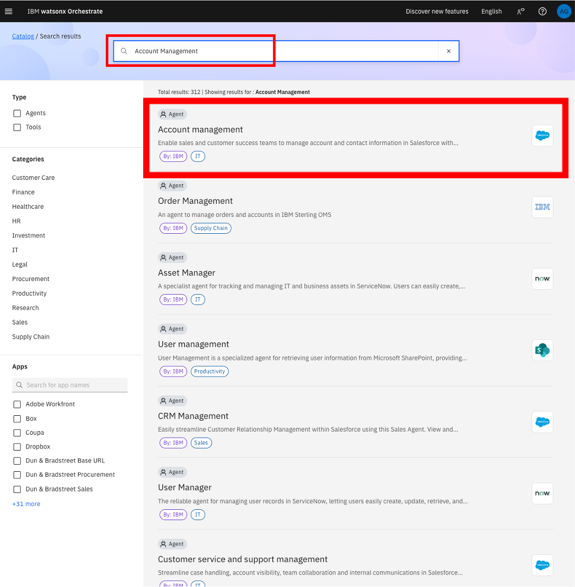
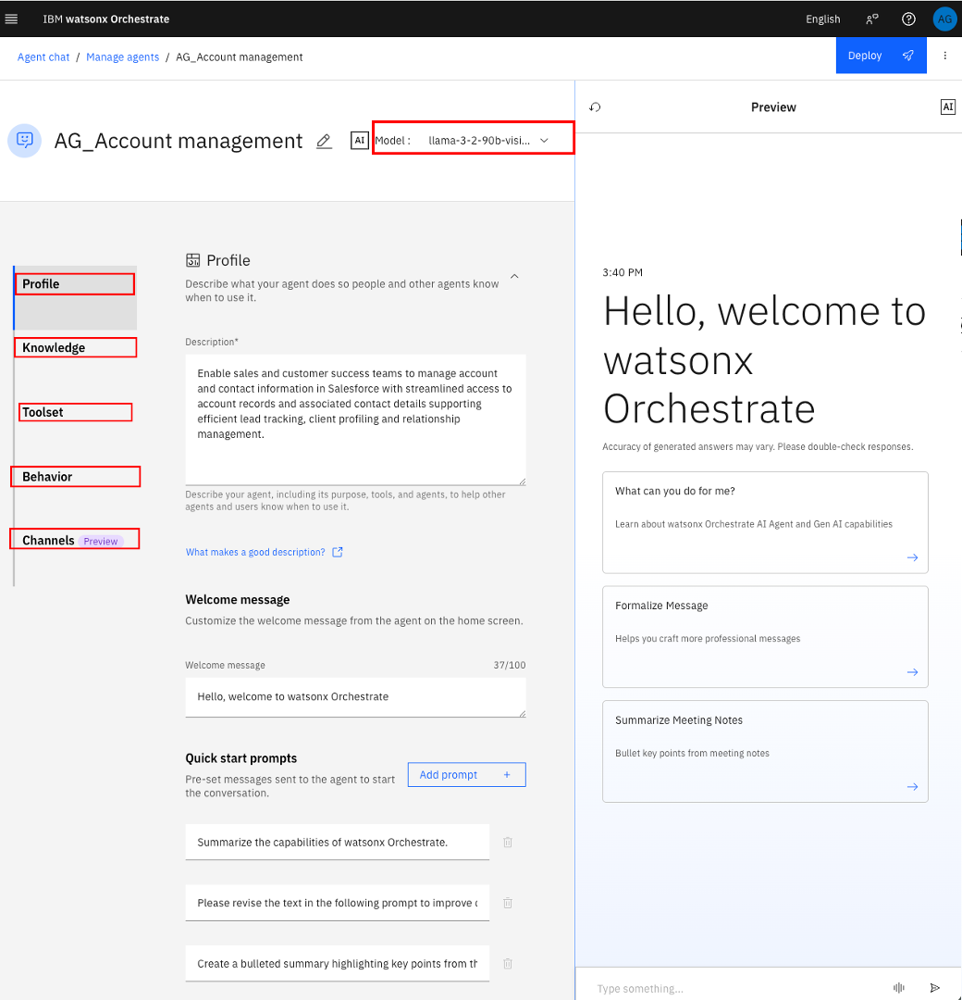
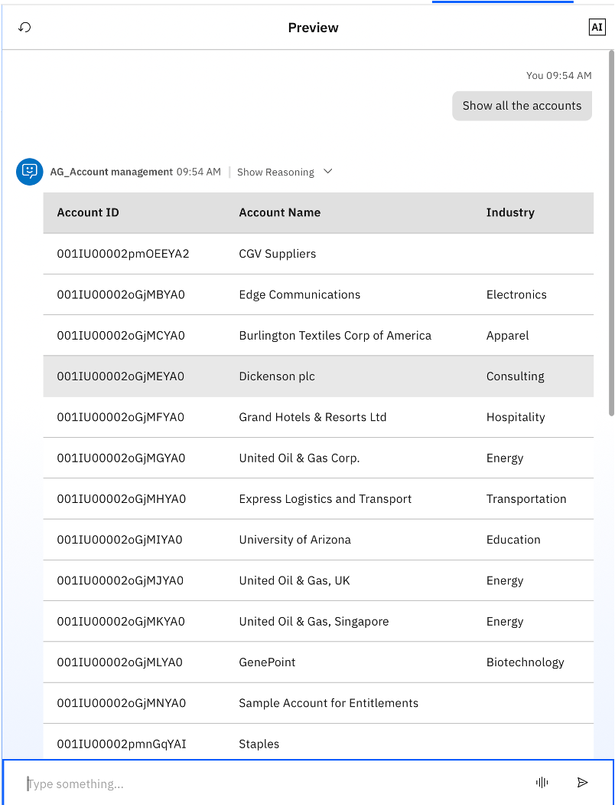
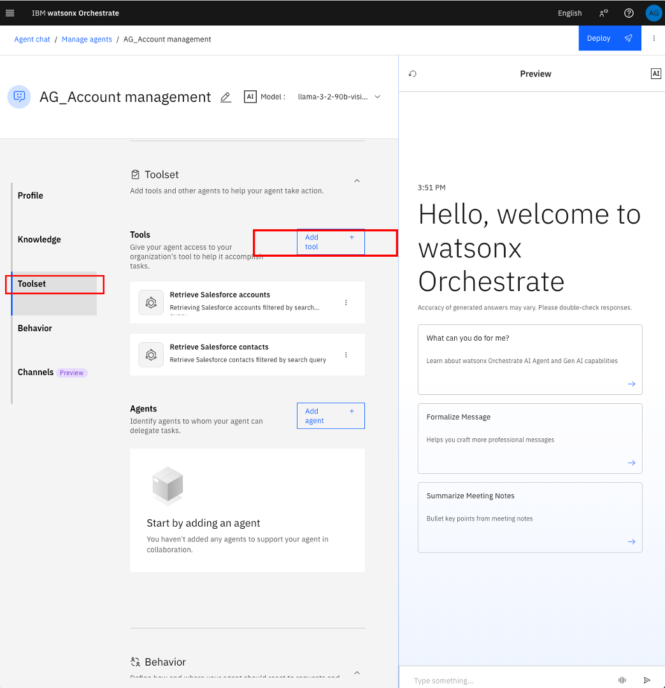
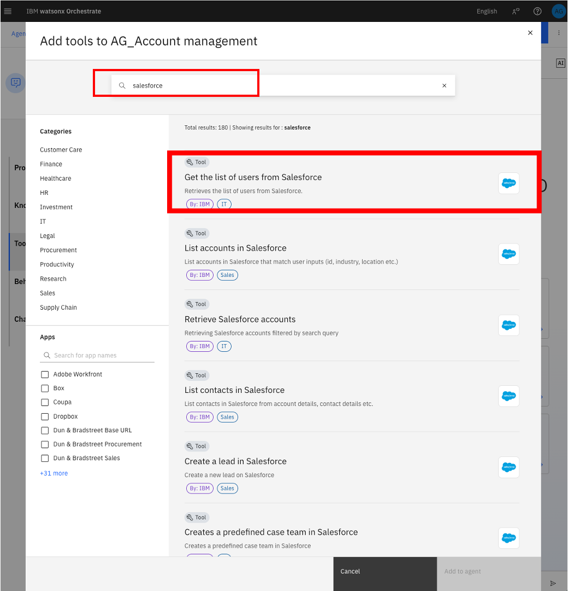
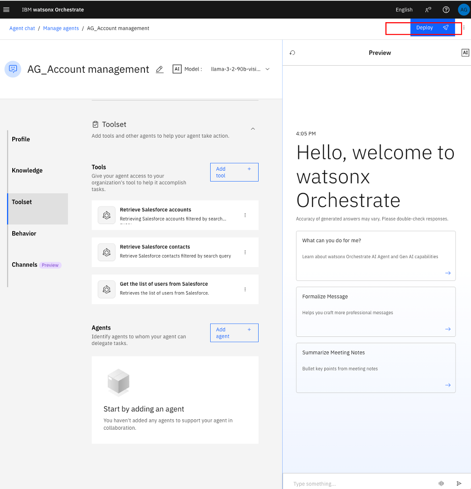
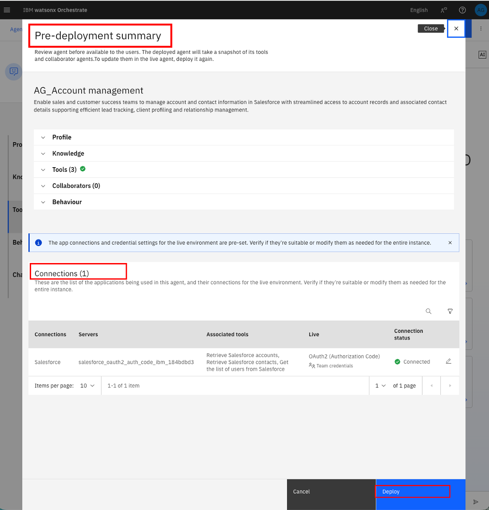
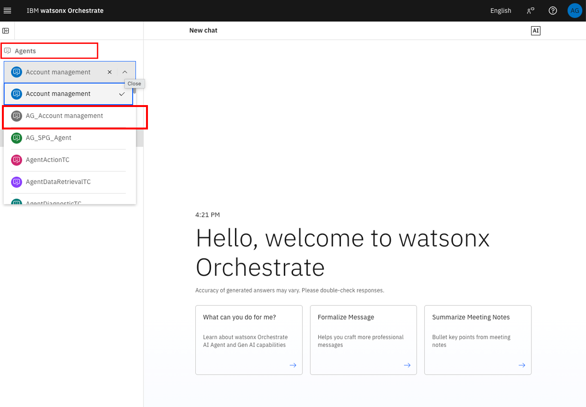
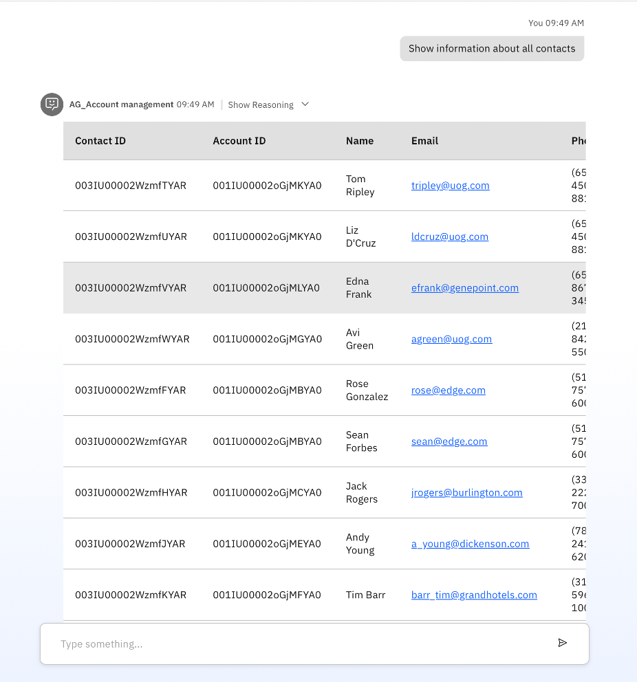

# 🧑‍💼 Lab 1: Prebuilt Agents and Tools

## Objective
The IBM watsonx Orchestrate catalog serves as a vast repository of prebuilt AI agents and tools, tailored to address a wide array of use cases and requirements. This extensive collection helps you discover agents, tools, or a blend of both that align with your specific needs. In this lab, we will use one of the prebuilt agents to demonstrate how easy it is for a user to start the agent-building journey.

Each watsonx Orchestrate prebuilt agent and tool is connected to a service. Services require connections to be established. For this lab, we have already created the necessary connections.

## Key features of prebuilt agents include:
Pre-configured: Prebuilt agents come with pre-defined settings and configurations for easy setup.
Reusable: Prebuilt agents can be used across multiple workflows, reducing the need to recreate similar tasks.
Task-specific: Each prebuilt agent is designed to perform a specific task or set of tasks, such as data processing, API calls, or notifications.
    
In this lab, you will build a Procurement Agent using watsonx Orchestrate. This agent will allow you to generate the information about all the accounts. You can also enquire about any specific account details.   

We are leveraging Prebuild agents and tools. The tools we are using in this lab, are from Salesforce. We have already integrated two tools here "Retrieve Salesforce accounts" and "Retrieve Salesforce contacts" to demonstrate the watsonx Orchestrate capabilities to connect with different third party tools. 
The IBM watsonx Orchestrate Catalog is your gateway to a rich collection of prebuilt AI agents and tools, designed to support a wide range of business functions and use cases. Whether you're looking to automate tasks, enhance productivity, or integrate with backend systems, the catalog helps you find the right solutions quickly and efficiently.

## Let's start our IBM watsonx Orchestrate learning journey: 

### Step by step instructions to build the Pre-built Procurement Agent:

1. When you launch watsonx Orchestrate, you'll be directed to this page. Click on the hamburger menu in the top left corner:

    

### Discovering the Catalog
1. From the hamburger menu on the top left corner, select “Discover”
    
2. You will be presented with this view
    

3. Currently, all the prebuilt agents and tools are separated into many domains/categories (in this view you can see aroud 12 different categories of the domain)
4. Feel free to click on one of the categories and see what is available for you.
5. In this lab, we will be using prebuilt agents and tools from the IT category.

### Building an Procurement Agent

1. Go back to the hamburger menu and click on “Discover” again if you’ve navigated away.
2. On the search bar, search for “Account Management” and hit Enter. Click on the “Account Management” agent once the search result comes back.
   

3. Once you clicked on the “Account Management”, you will be presented with this view.
   

4. You will be able to see what this agent is doing, the tools it is using. From this page, we will be able to assess if this agent is suitable for your use case.
5. To use this agent, click on the “Use as template” button on the top right.
    

6. You will be presented with the Agent Builder page.
   
7. Edit the name so that it is unique. Change the agent’s name to [Your Initial]_Account management.
   
   
8. Save the new name to the agent. 
   

9. Now, It all set. Your agent is ready. Keep the rest of the agent set up as it is and let’s explore the agent. You can see the "Model" at top and "Profile", "Knowledge", "Toolset", "Behaviour" and "Channel" at the left side. Just explore one by one to get an understanding on the different blocks of the agent.
    
   
10. Let's explore the "Preview" window given in the right side. In the “Preview” panel on the right, You can try some queries to test the performance of the agent at your local.
    

11. In the “Preview” panel on the right, let’s try one query. as "Generate the information of all the accounts" or "show all the accounts"
    

12. If you face any problem with step 11, please alert one of your friendly instructors.
13. Prebuilt agents present an easy way to build an agent. However, we can also edit the prebuilt agent. Let’s explore a bit by adding an extra tool into this agent.
14. Click on "Toolset" from the leftside panel or Scroll down to the toolset and click on “Add tool”.
    

15. Click on “Add from catalog”.
     

16. On the search bar, type in “salesforce”. Select “Get the list of users from Salesforce” from the search result.  
    
17. After you click on the tool, you will be able to see the input and output the tool is expecting. Once you’re ready, click on “Add to agent” on the bottom right.
    

18. Once returned to the agent builder page, you will see the additional tool added to the tools list.
    

19. After building the agent, we can deploy our agent. Click the “Deploy” button on the top right. Keep all default settings when being asked.
    
20. You will see the "Pre-deployment summary" to review all the changes / updates you made to your agent. You can also see the total connections, you created to the third party tools. In our example, it is "Salesforce".
    
21. Once the deployment is success, navigate to “Chat” from the left-hand hamburger menu.
    
22. From the dropdown menu, select your agent.
    
23. Now, you can use use your agent. Try to ask some queries. "Generate information about all accounts" 
    
24. Try with another prompt / query: "Generate information about all contacts"
    

**Congratulations! You've built your first Procurement Agent using Pre-built agents and tools.**
