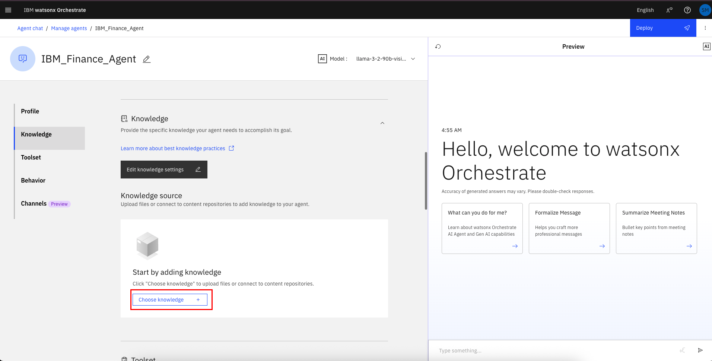
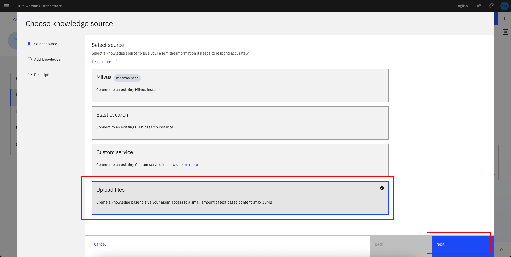
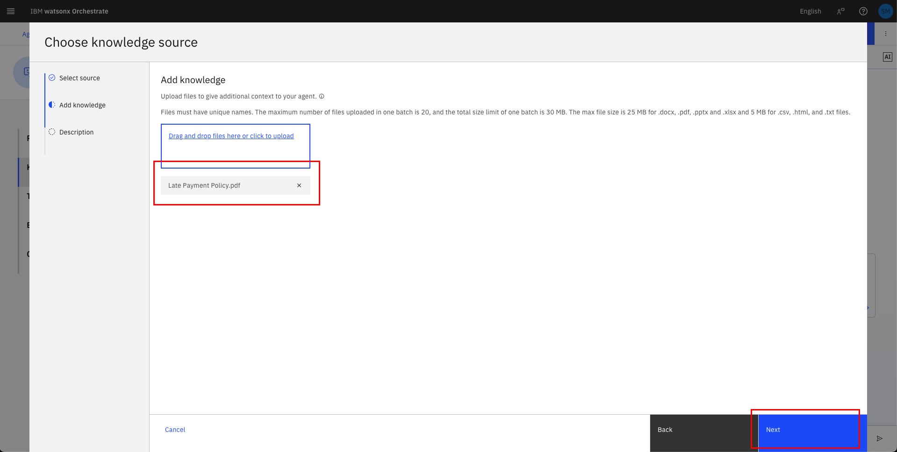
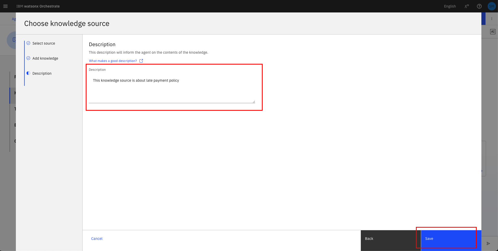
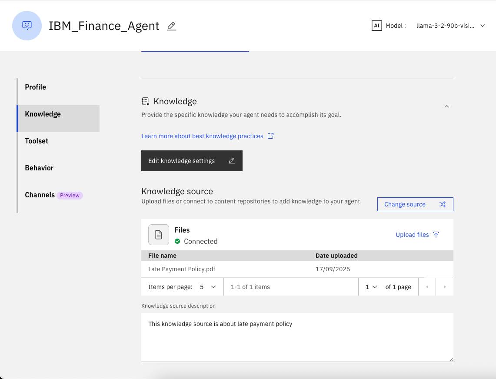
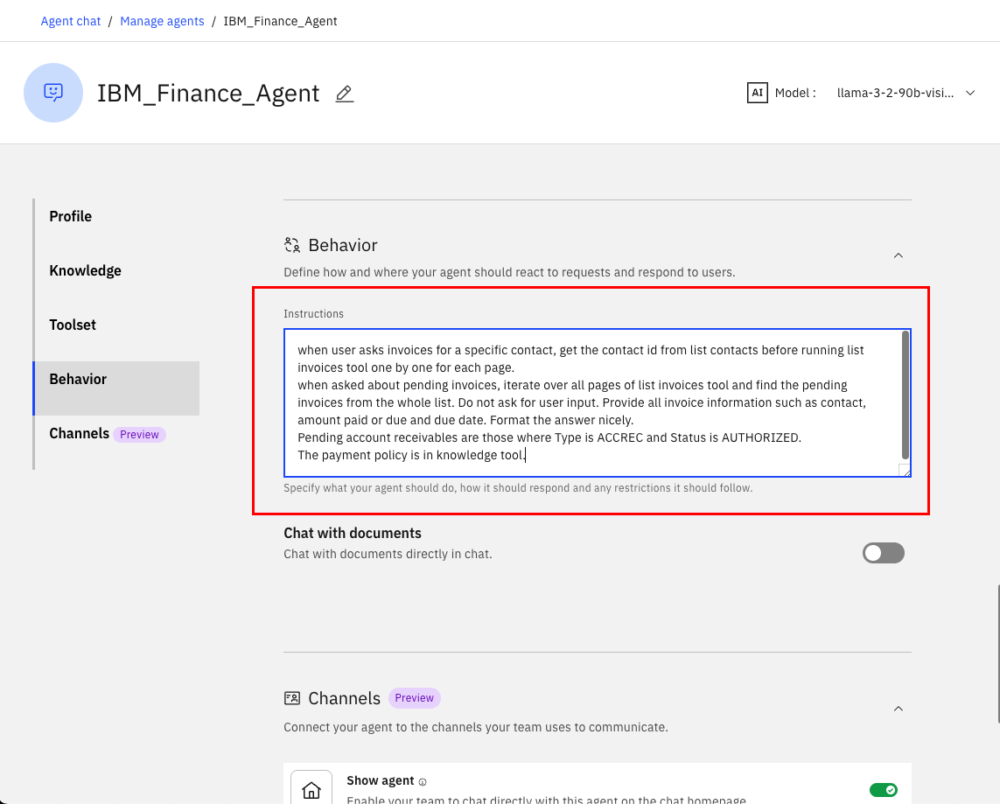
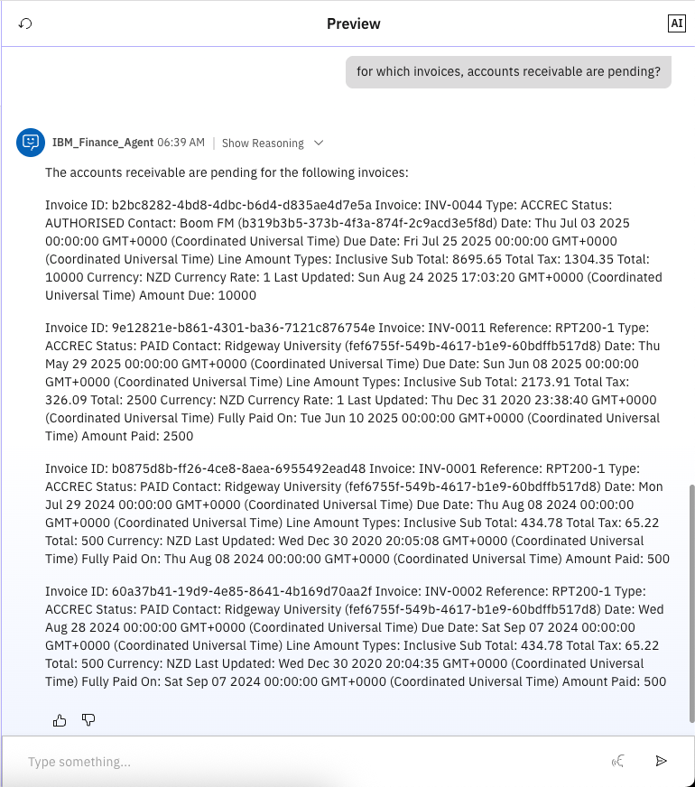
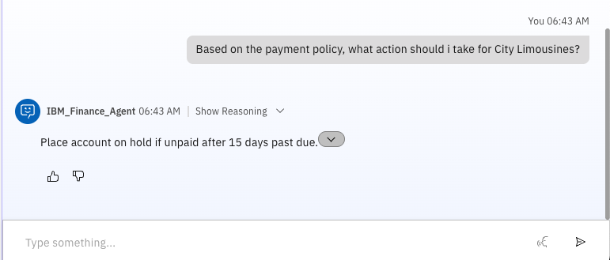
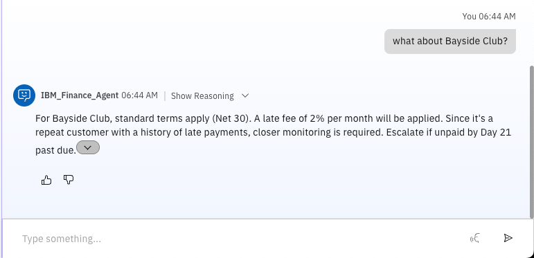

# 🏦 Finance Agent: Automate finance oriented tasks with Agentic AI. (Lab 2: Adding Knowledge Base)

## Use Case Description

In lab 2, we will add knowledge to our Finance agent in watsonx Orchestrate, and enable it to answer questions based on a knowledge base.

1. Scroll down the screen to the **Knowledge** section:
   

2. Click on **Upload files**. Then click on **Next**:
   

3. Drag and drop the [Late Payment Policy.pdf](pdfs/Late%20Payment%20Policy.pdf) and click on **Upload**:
   

4. Fill the description as shown below and click on **Save**:
```
This knowledge source is about late payment policy
```
   

5. Wait until the file has been uploaded successfully and double check that it is now shown in the **Knowledge** section:
   

6. Scroll to the **Behaviour** section and update the **Instructions** field:
```
when user asks invoices for a specific contact, get the contact id from list contacts before running list invoices tool one by one for each page.
when asked about pending invoices, iterate over all pages of list invoices tool and find the pending invoices from the whole list. Do not ask for user input. Provide all invoice information such as contact, amount paid or due and due date. Format the answer nicely.
Pending account receivables are those where Type is ACCREC and Status is AUTHORIZED.
The payment policy is in knowledge tool.
```
   

7. Test your agent in the preview chat on the right side by asking the following questions and validating the responses. They should look similar to what is shown in the screenshot(s) below:
```
for which invoices, accounts receivable are pending?
```


```
Based on the payment policy, what action should i take for City Limousines?
```


```
what about Bayside Club?
```
