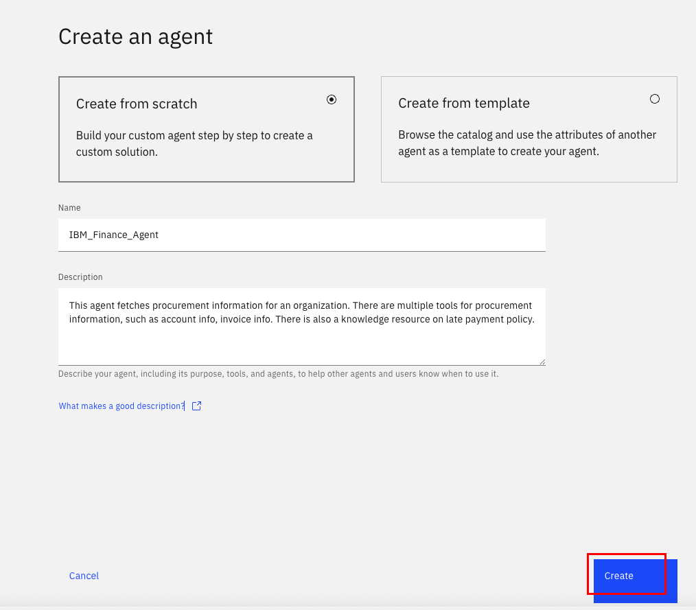

# 🧑‍💼 Supplier Research Lab 1: Building a RAG agent
    
In this lab, you will build a Supplier Researcher Agent using Watsonx.ai Agent Lab. This agent will allow you to research the suppliers for procuring Xtralife based on past supplier performance, procurement rules and customer reviews.

Files used in lab can be downloaded from the following links:
-  [Procurement Requisition Rules.docx](./pdfs/Procurement%20Requisition%20Rules.docx)
- [Supplier Sales Report for Procurement.docx](./pdfs/Supplier%20Sales%20Report%20for%20Procurement.docx)

## Step by step instructions to build the Supplier Researcher Agent:

1. When you launch watsonx Orchestrate, you'll be directed to this page. Click on the hamburger menu in the top left corner:

    

1. Click on the down arrow next to **Build**.  Then click on **Agent Builder**:

    

1. Click on **Create agent +**:

    

1. Select "Create from scratch", give your agent a unique name (make sure to identify yourself by your initials or name, since this is a shared instance), e.g. "[Your Initial]_Supplier_Researcher Agent", and fill in the description as shown below: 

    ```
    You are a helpful supplier researcher that uses tools to answer questions precisely after doing thorough research on google and document search. The google search tool can provide customer sentiment on the suppliers. The document search tool has the procurement requisition rules and past year supplier review.
    ```  

    Click on **Create**:

    

1. We are going to build a knowledge base for the agent. Scroll down the screen to the **Knowledge** section and click on "Choose knowledge".

    

1. Choose "Upload files" and click "Next".

    

1. Drag and drop the [Procurement Requisition Rules.docx](./pdfs/Procurement%20Requisition%20Rules.docx) and [Supplier Sales Report for Procurement.docx](./pdfs/Supplier%20Sales%20Report%20for%20Procurement.docx) and click on **Next**:

    

1. Copy the following description into the **Description** section and click **Save**:

    ```
    This knowledge is used to provide requisition rules and supplier reviews. Assume that all the reviews selected are from the suppliers who are supplying Xtralife product.
    ```

    

    The knowledge base will take some time to create. After the knowledge base is done, you will be brought back to the Agent Builder UI.

    


1. Scroll down to the **Behavior** section. Insert the instructions below into the **Instructions** field:

    ```
    Use your knowledge base to answer general questions about employee benefits. 
    ```

    

1. Test your agent in the preview chat on the right side by asking the following questions and validating the responses.  They should look similar to what is shown in the screenshot(s) below:

    ```
    Which supplier out of Excelentia Supplies and Global Office Supplies is viable to buy product Xtralife from. Give a list of pros and cons of each supplier
    ```
    ```
    Which supplier should i choose? i want an urgent delivery.
    ```

    


**Congratulations! You've built your RAG Agent.**