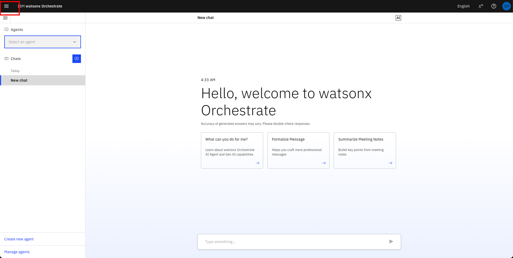
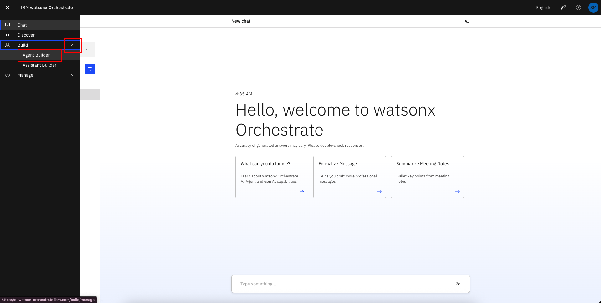
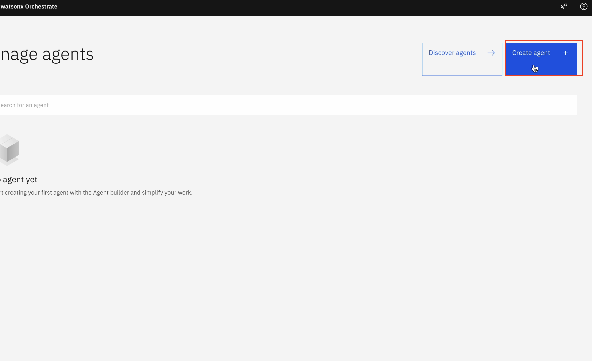
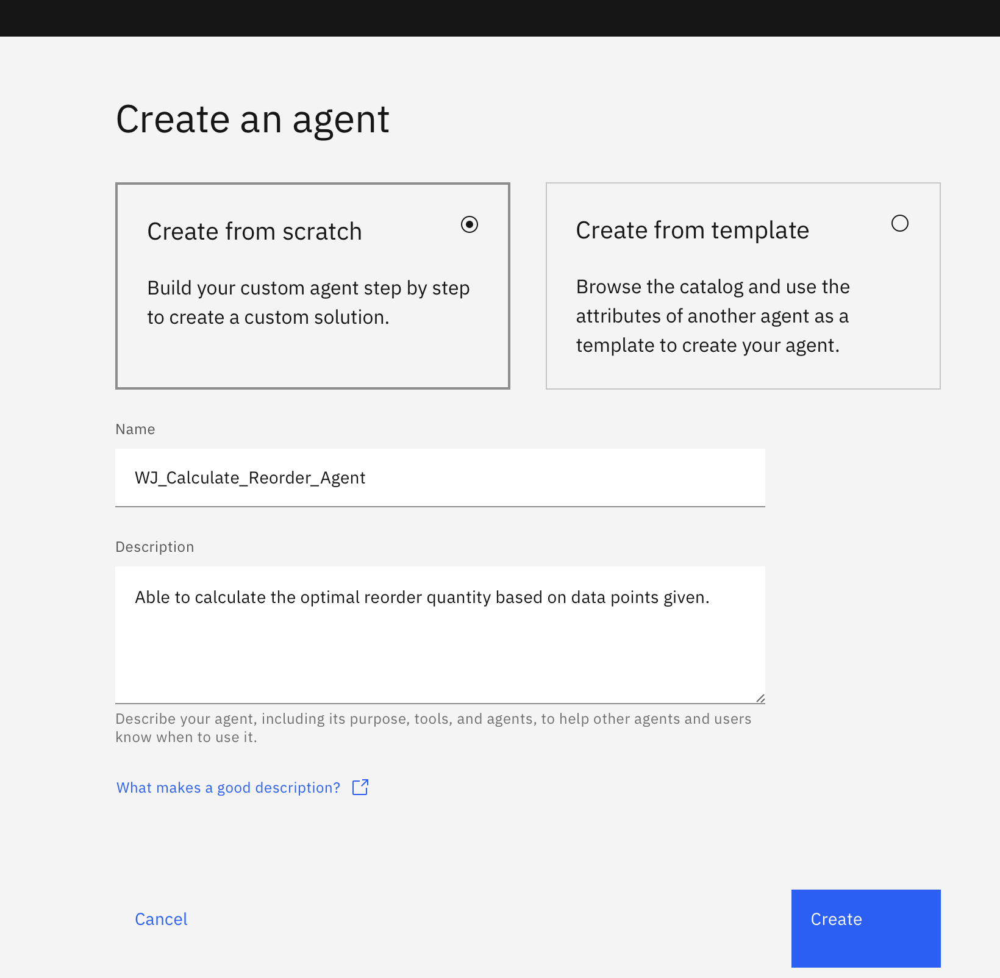
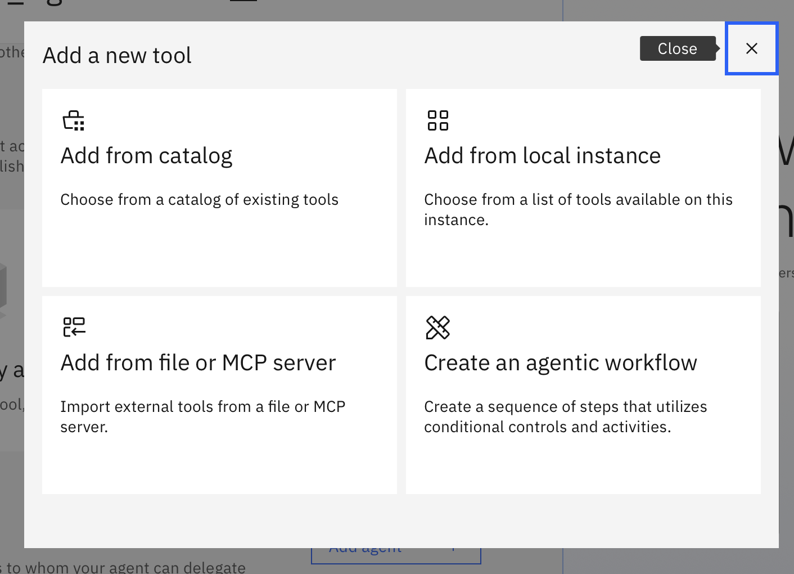
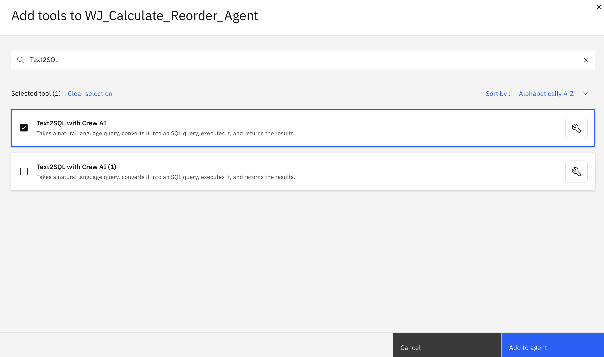
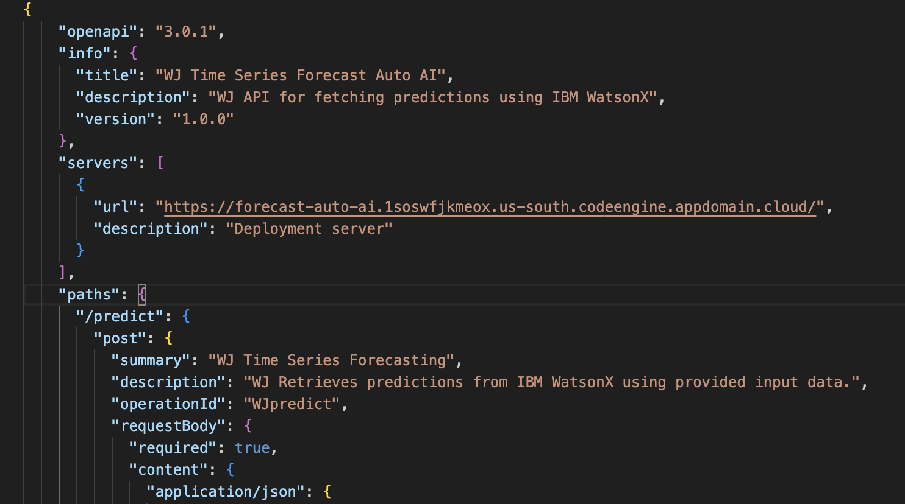
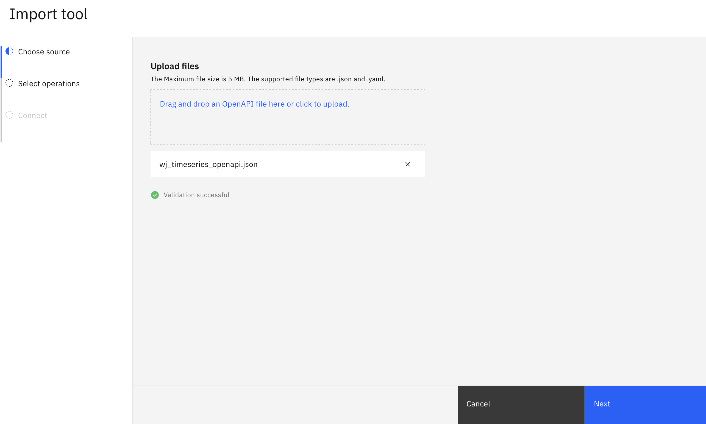
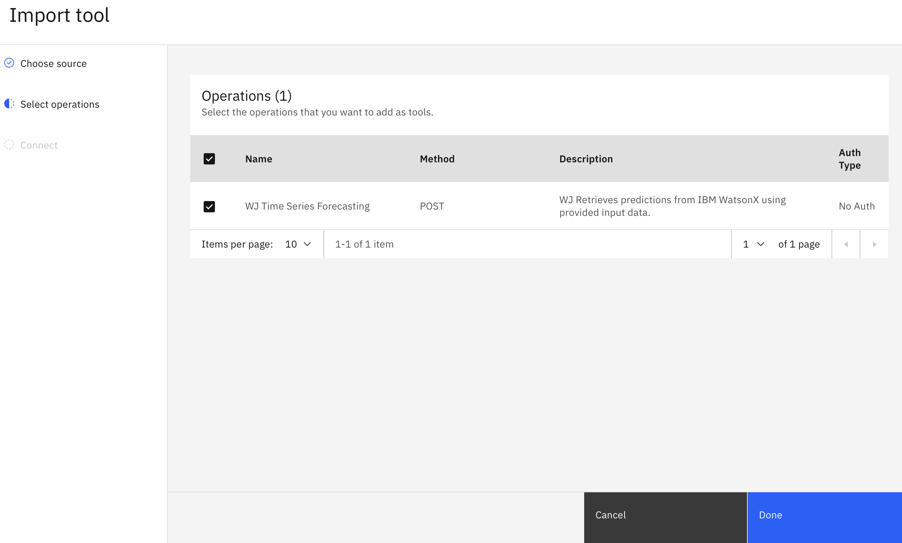
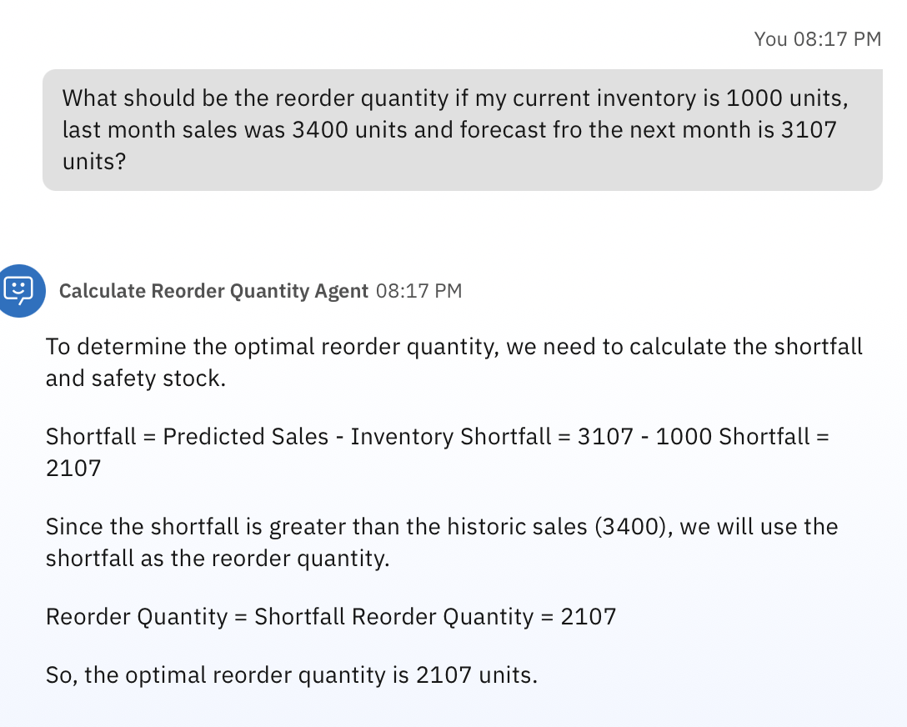

# 🏦 Calculate Reorder Agent Lab 2b: Integrating External Tools

In this lab, you will build a Calculate Reorder Agent using Watsonx Orchestrate. This agent will allow you to integrate external tools, autoai (for time series forecasting) and txt2sql (to query stock data), to calculate an optimal reorder quantity.

Files used in lab can be downloaded from the following links:
-  [timeseries_openapi.json](/Lab_2b_Files/timeseries_openapi_new.json)

## Step by step instructions to build the Calculate Reorder Agent:

1. When you launch watsonx Orchestrate, you'll be directed to this page. Click on the hamburger menu in the top left corner:

    

1. Click on the down arrow next to **Build**.  Then click on **Agent Builder**:

    

1. Click on **Create agent +**:

    

1. Select "Create from scratch", give your agent a unique name (make sure to identify yourself by your initials or name, since this is a shared instance), e.g. "[Your Initial]_Calculate_Reorder_Agent", and fill in the description as shown below: 

    ```
    Able to calculate the optimal reorder quantity based on data points given. 
    ```  

    Click on **Create**:

    

1. Once the "[Your Initial]_Calculate_Reorder_Agent" has been created, scroll down to Toolset > Add Tool and add the following tools.

1. Adding the txt2sql tool

    Click “Add from local instance”.

    

    Search for "Text2SQL". Select it and add to agent.

    

1. Adding the timeseries auto ai tool

    As we will be using a shared instance for this workshop, we will need to make slight modification to this script to avoid confusion and skills clashes.
        
    Download the [timeseries_openapi.json](../Lab_2b_Files/timeseries_openapi_new.json) custom skills script from here. Depending on your location, the version you need will be different. Do check with your instructor which one is required.

    Open up the script with a code editor or notepad and update the following

    a. Update title to “[Your Name] Time Series Forecast Auto AI” <br>
    b. Update description to “[Your Name] API for fetching predictions using IBM WatsonX” <br>
    c. Update summary to “[Your Name] Time Series Forecasting” <br>
    d. Update description to “[Your Name] Retrieves predictions from IBM WatsonX using provided input data. <br>
    e. Update operationid to “[Your Name]predict” (no spacing)

    

1. Save the script.

1. Click "Add from file or MCP server".

    

    Select "Upload from File". Upload your modified json file.

    

1. Select the listed operation and press Done.

    

1. Select the Agent Style as “React”.

1. Scroll down to the Behavior section. Insert the instructions below into the Instructions field:

    ```
    Using the information given by the user you are to suggest an optimal reorder quantity based on the following information:

    You will need to ensure that you have information for current stock level, past sales performance and predicted sales quantity. The current stock level is 1000.

    To get historic months sales value and quantities, you must always run the processQuery tool using the product Xtralife as keyword. For example you should always ask "What is the quantity sold last month for Xtralife". If there is no sales data for last month, create a number between 3500-4000.

    To get predicted sales or predicted sales quantity, you can use time series forecasting tool.

    Determine the optimal reorder quantity to ensure sufficient stock while minimizing excess inventory.
    Instructions for calculating the optimal reorder quantity:
    1. Shortfall calculation.
        - Shortfall = Predicted Sales - Inventory
    2. Saftey stock calculation
        - If shortfall  historic sales:
            Reorder Quantity = Shortfall

    The current inventory should be from another tool or input by user. 
    ```

1. Test your agent in the preview chat on the right side by asking the following questions and validating the responses.  They should look similar to what is shown in the screenshot(s) below:

    ```
    What should be the reorder quantity if my current inventory is 1000 units, last month sales was 3400 units and forecast fro the next month is 3107 units?
    ```

    

**Congratulations! You’ve built your RAG Agent.**