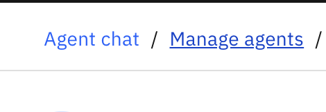
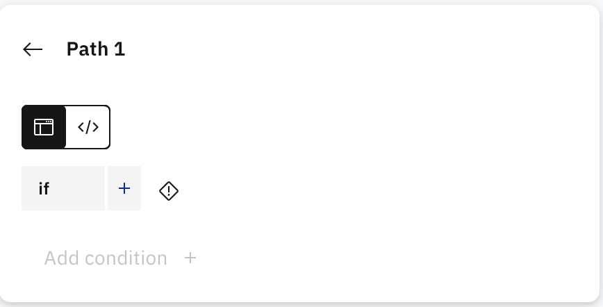
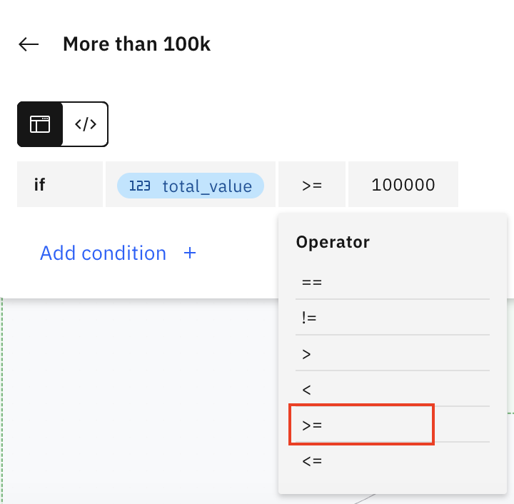
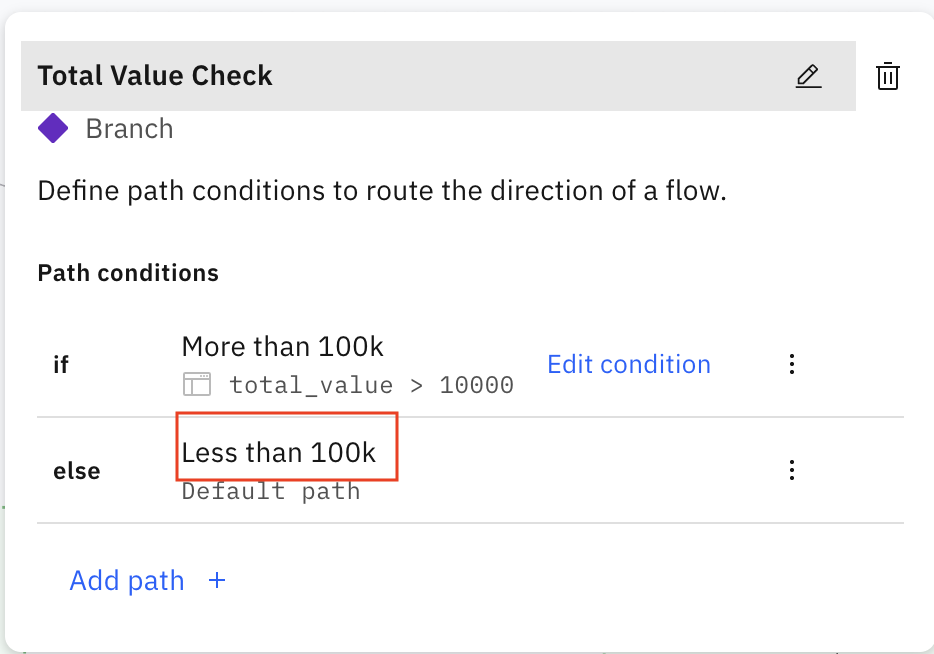
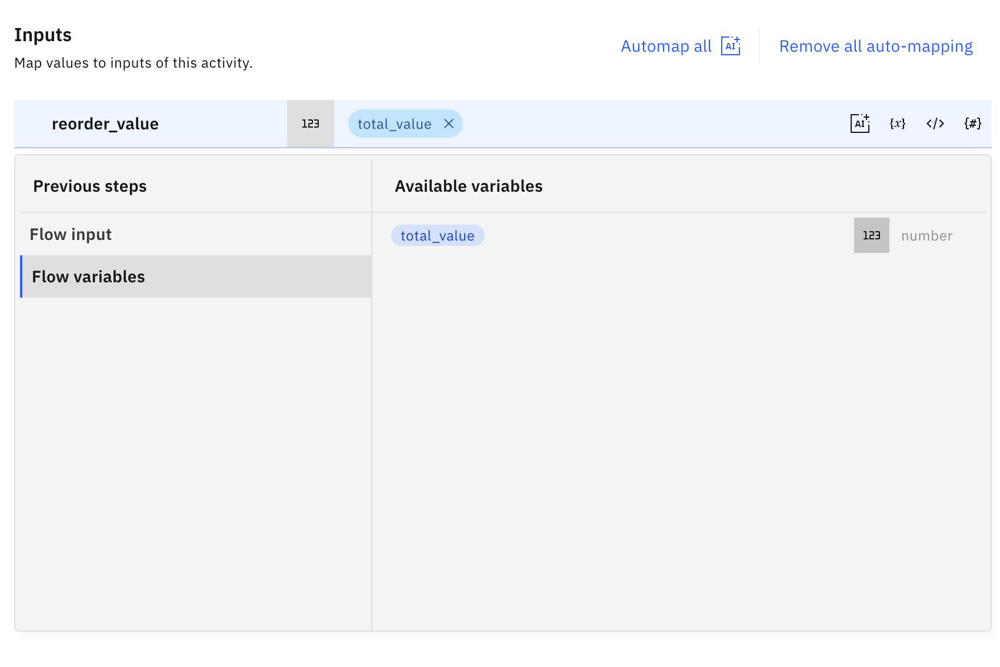

🧑‍💼 AskProcurement Lab 3: Introduction to Flows for Agents
=================================================================================

In this lab, we will focus on a new way to create a tool - Flows!

**Why do we need flows?** **Agentic AI seems to be able to perform what I want, I don't want to design any flows**

While agents seems like they are able to perform tasks to fulfill users' requests using the tools available to them, there are still situations where a deterministic flow is important. For example in a procurement scenario, the agent must take necessary steps and put out a suitable alert if the order is over the company's agreeable amount. 

In this lab, we will design a flow which will take in reorder quantity and supplier's unit price from previous labs and determine if the order is over the approved amount (as stated in the procurement requisition documents). The flow will also generate emails addressed to relevant parties for approval if necessary.

A summary of the flow we are going to perform is as below:


Step-by-step instructions
=========================

1.  Go to "Manage Agents"  
    

1.  Click "Create Agent"

    

1.  Type the following:  
    Name: \[Your Initials\]\_askProcurement

    Description:

    ```
    You are an agent who specializes in procurement processes.
    You help the procurement officer with processes such as supplier research, calculating reorder amount and placing orders.
    Example of command: I want to reorder product Xtralife.
    ```
    
1.  Once the \[Your Initials\]\_askProcurement has been created, scroll down to Toolset > Add Tool and click on **Create an agentic workflow**.
    
    
1.  You will see the following UI once the tool settings are loaded.

    

    **TIPS:**
    If your menu pane does not appear, you can click on the **+** button to bring it out.

    
1.  Just like an agent, we will also need to name and describe our tool. Click on the pencil icon on the top left corner.

    
1.  Fill up the following fields:

    Name: \[Your Initials\]_Check reorder quantity

    Description: The flow to check reorder quantity and generate relevant email templates or message

    
1.  After that, move downwards where we can define inputs to the flow. Click on **Add input**  

    
1.  We are creating 2 inputs. Follow details shown in the table below

    | Type     | Name            | Description                               | Required        |
    |----------|-----------------|-------------------------------------------|-----------------|
    | Decimal  | supplier_price  | The unit price of Xtralife for a supplier | On              | 
    | Integer  | reorder_quantity| Amount to reorder                         | On              |
    
    Example of how to create inputs:

    

    

1. You will have a resulting table as below. Click on **Save** when you're done.

    

1. Next, we will also need to create a variable to keep track of the total reorder value. Click on the green triangle to get the following pop out. Click on the pencil icon next.
    

1. Then click on **Add** and **Decimal**
    

1. Input the following

    Name: total_value
    Description: Total reorder value

    Click **Add**
    
    
1. We will start creating the flow by inserting a branch to check the total reorder value. We will need to multiply both the inputs.<br>From the tools menu, drag out a **Code Block**. Ensure that the tool snaps on the flow.

    

1. Click on the code block tile  and click on Open code editor. 

    

1. In the empty space, start typing `flow` and there will be suggestions appearing. Select `flow.private.total_value`.

    

1. Continue to type out the expression until you get the following.

    

1. Now let's have different action for different situation. Drag out a **Branch** tool on to the flow. 

    

    

1. Now, we will add the branching condition. Click on the purple diamond shape and a menu will pop out for you.  
    
    
1. Hover on **Branch1** and click on the pencil icon. Rename Branch 1 to **Total Value Check** and click the tick icon.
     

1. Now let's add the different conditions based on this flow.

    

    Click on **Edit Condition**

    


    

1. Click on the **+** beside the if and switch to **Flow variable** and select **total_value**

    
    

    

    Select the **>** sign from the drop down and change the value to 150000.

    

    

1. You can also try to rename the path by clicking on Path 1 and Path 2

     

    

1. Click anywhere to return to the canvas. For the path with more than 150k, we want the flow to assist in generating an email template to seek approval from senior management.

    From the menu, drag and snap **Generative prompt** tile on to the flow.

    

    You will be presented with a UI where you can design prompts.

    

1. Create a input variable

1. Copy and paste the following into the system prompt and User prompt

    System prompt:

    ```
    You are a helpful system assistant. Your task is to help a purchasing officer to craft an email.
    
    ```

    User prompt:

    ```
    Based on the reorder value {reorder_value}, you are to generate an email to your sales manager, Mr Wong, to seek approval this reorder value. This reorder value is over the approved budget of $150000. You can create a reason for this order such as nearing festivities and you foresee that there is a surge in sales for the product Xtralife. Be professional and avoid long-winded explanation.
    
    ```

    

1. Now we need to associate the calculated total reorder value with the input variable for our prompt to generate the email.

   Click on the Generative Prompt tile on our flow and then click on Data Mapping

   

   

   As you can see, we can actually leave the mapping to AI. However, since we want to be very sure that the input is captured correctly, we will map it manually.

1. Once you hover on the input bar, click on the variable icons. 

    

    Switch to **Flow variables** and select **reorder value**.

    

1. After the email is being generated by the LLM, we want to display it to the user. We will drag in a **User activity** tile into the flow.

       

1. Hover in the green box and click on the **+**.

       

1. Select **Display to user** and the **Message** tile.

       

      

1. Click on the **Message** tile to get the following pop out.

      

1. Click on the variable icon, switch to **Generative prompt** and click on **value**

      

1. Next, let's repeat the above steps to create a notification to let user know that their order has been placed when their order is below $150,000.

    Click on the **Add** icon and select **User activity**.

      

1. Hover in the green box and click on the **+**.

       

1. Select **Display to user** and the **Message** tile.

       

      

1. Click on the **Message** tile to get the following pop out.

      

1. Copy and paste the following message.

    ```
    Your order is approved. You can proceed to place your order.
    ```

      

1. Now that our flow is done, we can click on **Done** on the top right corner.

