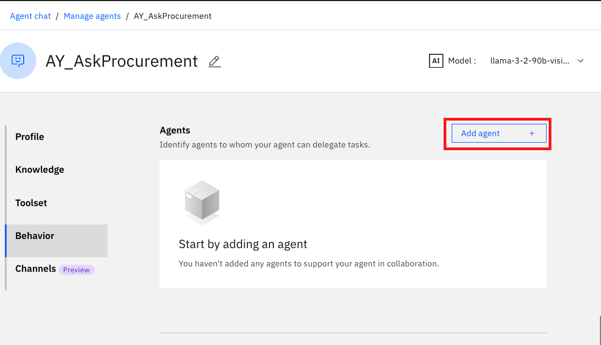
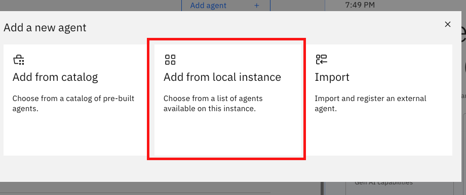
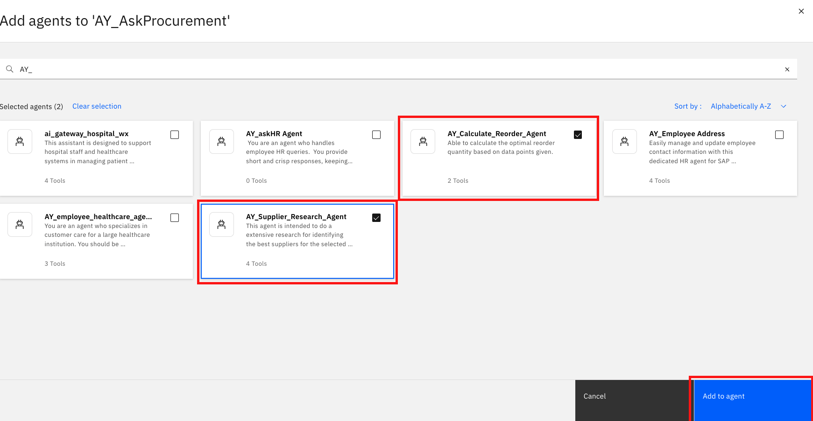

🏦 AskProcurement Lab 4: Multi-Agent Collaboration
=================================================================================

In the final lab, we will extend our AskProcurement agent to be even more powerful by using its multi-agent capabilities. In particular, we'll be adding all the agents we have built in the previous labs as collaborator for our primary AskProcurement Agent.

Step-by-step instructions
=========================
1.  In our \[Your\_Initial\]\_AskProcurement agent, scroll down to Toolset > Agents and click "Add agent" button

    

1.  Click "Add from local instance"

    

1.  Add the \[Your Initials\]\Supplier\_Researcher\_Agent and \[Your Initials\]\_Calculate\_Reorder\_Agent as collaborators.

    

1.  Scroll up & update the agent **Description**:
    ```
    You are an agent who handles employee HR queries. You provide short and crisp responses, keeping the output to 200 words or less. You can help users check their profile data, update their addresses within the SAP system.You can also reroute to an employee_healthcare_agent for answering questions related to employee health insurance policies, providers/doctors, medical claims.
    ```

1. Scroll down and update the agent **Behavior**
    ```
    Use your knowledge base to answer general questions about employee benefits. For any questions related to benefits/incentives that are unrelated to healthcare, refer to your KNOWLEDGE.
    
    Reroute to the employee_healthcare_agent for any queries related to healthcare, medical appointments, healthcare providers (doctors), and health insurance, and use the outputs from this agent to respond.
    
    Reroute to the Employee Address agent when there are any request to update address of an employee. Ensure that you have all the information before you trigger the agent. If you need more information, get it from user.

    If the user wants to request for leave, route it to Leave Management agent. The location used must be SGP. Ensure that you have all the information before you trigger the agent. If you need more information, get it from user.

    After rerouting to any agent, be sure to return the agent's output in any subsequent query to the supervisor agent.
    ```
1.  Next let's refresh the page and then test our end-to-end AskProcurement demo.

1. Your results should mostly match the results in the [**demo\_video.mov**](https://ibm.box.com/s/97ykz714zpfvdx14j0o1hvbs5a6hrhd9).
    ```
    I want to apply for childcare leave for a day.
    ```
    ```
    jamie.tan@bestrun.sg
    ```

* Feature demonstrated: call a prebuilt collaborator agent


    ```
    I need to bring my son for a follow up appointment with his specialist for his ear infection. Can you remind me of what would be my copayment amount if I’m under HDHP in-network?
    ```

* Feature demonstrated: reroute to collaborator agent & call tool

    ```
    I wanted to bring him to a different doctor this time - for a second opinion - can you recommend one near Lowell?
    ```

* Feature demonstrated: reroute to collaborator agent & call tool

    ```
    I also need to update my address
    ```
