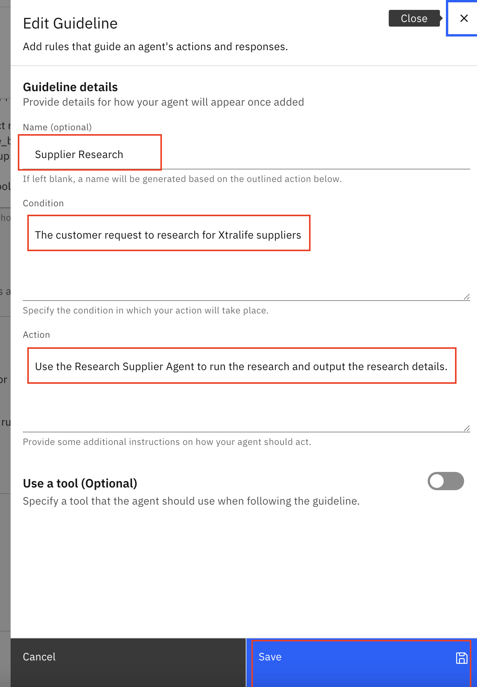

🏦 AskProcurement Lab 4: Multi-Agent Collaboration
=================================================================================

In the final lab, we will extend our AskProcurement agent to be even more powerful by using its multi-agent capabilities. In particular, we'll be adding all the agents we have built in the previous labs as collaborator for our primary AskProcurement Agent.

Step-by-step instructions
=========================
1.  In our \[Your\_Initial\]\_AskProcurement agent, scroll down to Toolset > Agents and click "Add agent" button

    

1.  Click "Add from local instance"

    

1.  Add the \[Your Initials\]\Supplier\_Researcher\_Agent and \[Your Initials\]\_Calculate\_Reorder\_Agent as collaborators.

    


1. Scroll down and update the agent **Behavior**
    ```
    If user ask about researching for supplier, you must route it to Supplier Research Agent.

    If user wants to perform any product reordering, you will need to first run the Calculate Reorder Agent and you must use fetch_price_books tool to get the unit price for different suppliers for Xtralife. If you do not know which supplier to choose, you must clarify with the user. 

    Thereafter, trigger the Check flow tool to check the reorder quantity.

    If the flow returns a message with order approved, proceed to create an order in Salesforce first using the create_order tool followed by create_product_in_order tool without any confirmation.
    ```
1.  We will use the **Guideline** to control the behavior of our agent to be more accurate.

    Fill in the following fields:

    Name: Supplier Research

    Condition: The customer request to research for Xtralife suppliers

    Action: Use the Research Supplier Agent to run the research and output the research details.

    

1. Next let's refresh the page and then test our end-to-end AskProcurement demo.

1. Your results should mostly match the results in the [**demo\_video.mov**](https://ibm.box.com/s/97ykz714zpfvdx14j0o1hvbs5a6hrhd9).
    ```
    Research for Xtralife Suppliers
    ```

* Feature demonstrated: call a collaborator agent


    ```
    How much should I reorder for Xtralife next month?
    ```

* Feature demonstrated: call a collaborator agent

    After you get the reorder quantity:

    ```
    Can I check if this quantity fits our company policy?
    ```

* Feature demonstrated: Call a flow tool

    If you get the following response:
    
    **Your order is approved. You can proceed to place your order.**

    ```
    Proceed to place order
    ```
* Feature demonstrated: Call a tool

    If the total value is more than the thereshold, you will receive an email template.