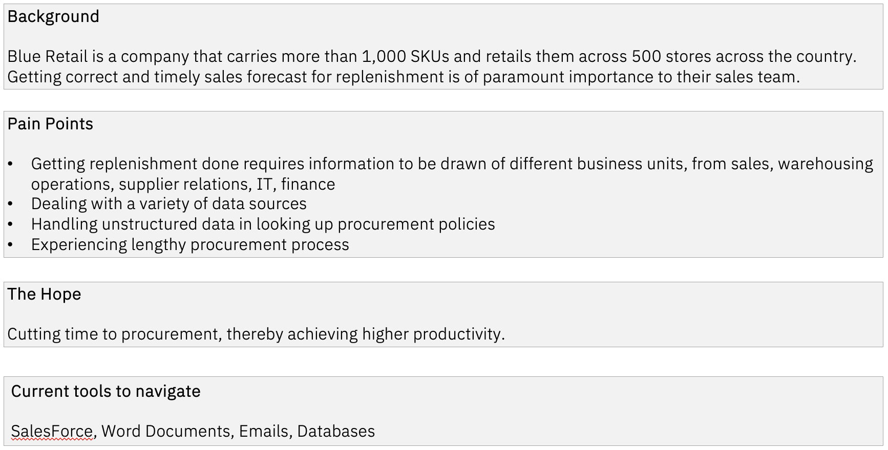
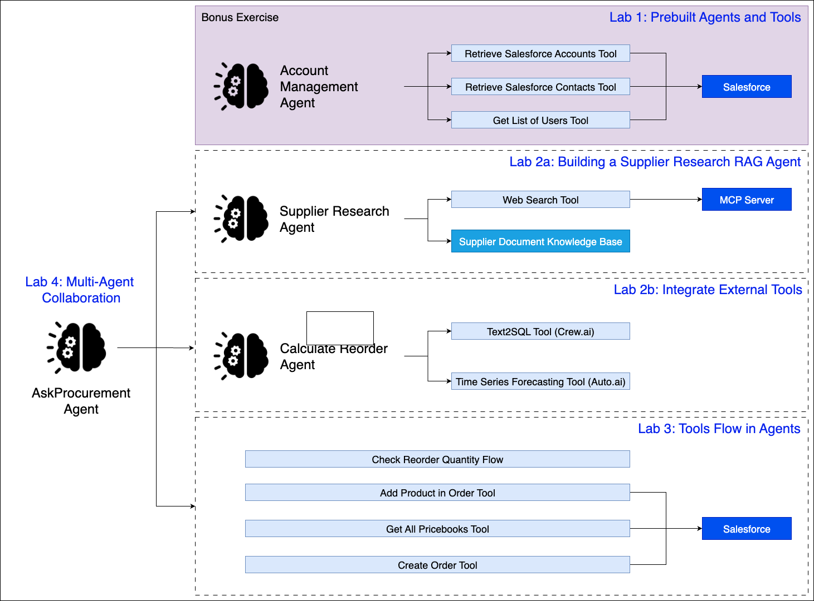

# Getting Started
1. These labs are for lab participants of IBM Agentic AI Incubation Workshop.
1. Ensure you have an IBM ID and access to a watsonx orchesetrate environment provided by the instructor.
1. Follow the instructions in Labs 1, 2 and 3.

# Lab Scenario: Introducing Blue Retail

# Lab Architecture
We will be building an AskProcurement Agent that allows Sarah to be able to ask Q&A about employee benefits, perform tasks such as update her mailing address, apply for leaves and even search for healthcare clinics all in one platform. 

